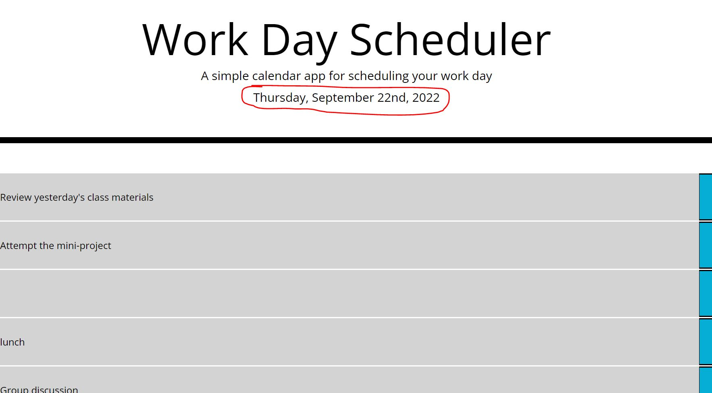
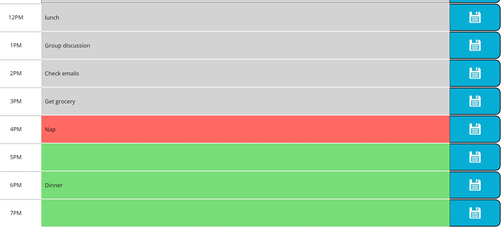

# Work-Day-Scheduler

Bootcamp Module 5 challenge of building a Work Day Scheduler with help from third-party APIs.

## Description

- This project involves third-party APIs such as Bootstrap, Moment.js, and J-Query.
- This is a single-day task tracker designed to help you keep track of what you currently need to do, what have you done/missed, and what will you need to do in the upcoming hours.
- Time blocks are highlighted with different colors to signify if it is in the past, present, or future.
- User can click on any time block to start entering/editing his/her task for that specific hour.
- A 'save task' is also available for users to save their tasks, so that even if the page refreshes the tasks will not disappear.
- A 'saved successfully' message will pop up to notify the user their task has been saved.

## Usage

- The current date will be shown in the header:
  ;

- Time blocks are highlighted with different colors:
  ;
